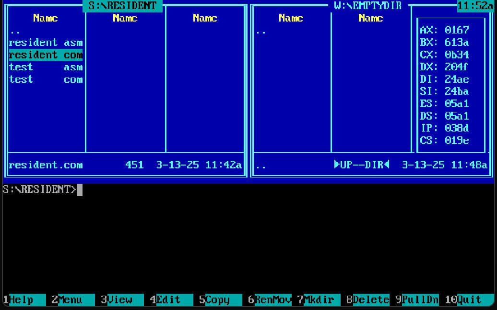
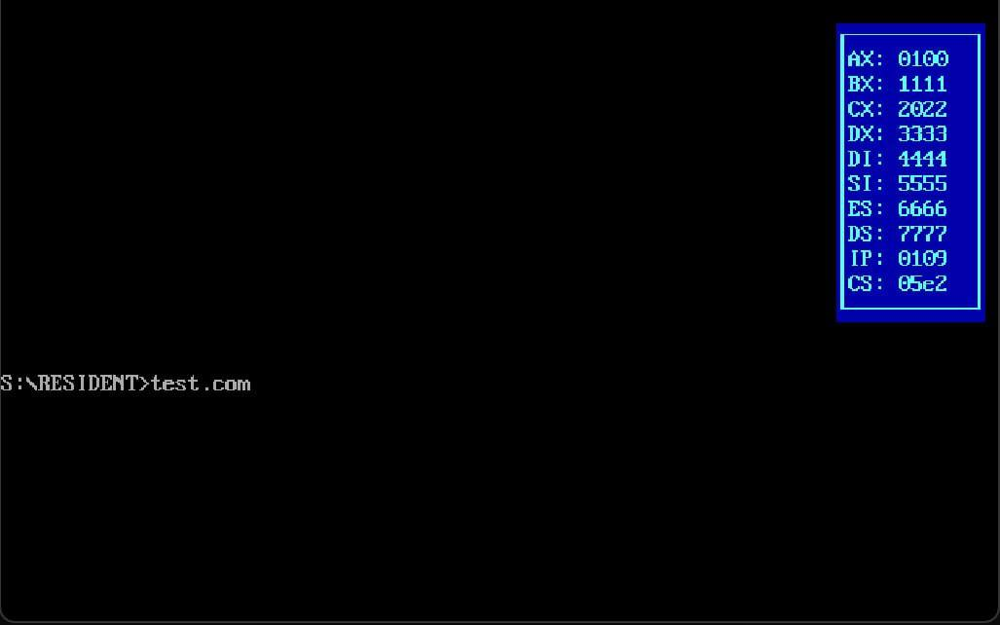

# Резидентная программа для DOS

## Установка и запуск

1. Компиляция: `tasm Resident.asm`
2. Линковка: `tlink Resident.obj`
3. Запуск: `Resident.com`

Если требуется отладчик, то можно использовать turbo debugger
(`td Resident.com`)

## Описание

1. **Перехват прерывания 9h (клавиатура):**
   - `F11`, чтобы активировать резидентную программу.
   - `F12`, чтобы остановить отрисовку регистров.

2. **Перехват прерывания 8h (таймер):**
   - После активации в  правом верхнем углу начнут отображаться значения регистров текущей исполняемой программы.
   - Значения регистров будут обновляться каждые 55 мс (~18.2 раза в секунду)

## Тестирование

Для проверки работы резидента можно использовать программу `Test.asm`, которая в цикле устанавливает регистрам определенные значения.
При нажатии на любую клавишу программа завершится.

